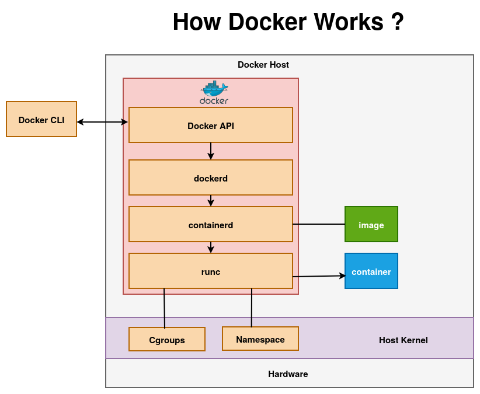

# How Docker Works ?

**When you run a command like:**

```bash
docker run --name nginx-container -p 80:80 -d nginx:latest
```

**Docker follows this internal flow:**



Docker runs containers by turning your CLI command into an API request that the Docker daemon (dockerd) understands.
The daemon prepares everything (images, network, storage) and hands execution to containerd, which manages the container lifecycle. Then runc actually starts the container as a process on the host.

At the lowest level, the Linux kernel isolates the container using namespaces (for separation) and cgroups (for resource limits).

---

## 1. Docker CLI

The **Docker CLI** is the interface you interact with directly to run commands like `docker run` or `docker build`. When you execute a command, the CLI translates it into an API request and sends it to the Docker daemon using the Docker API.

---

## 2. Docker API

The **Docker API** is a REST-like interface (typically accessed through `/var/run/docker.sock`) that acts as the communication bridge between the CLI and the Docker daemon. It defines all the operations required to manage containers, such as pulling images, creating containers, and starting or stopping them.

---

## 3. dockerd (Docker Daemon)

The **dockerd** daemon is the central brain of Docker that receives API requests from the CLI. It is responsible for high-level container management tasks like pulling images, setting up networking, and mounting volumes. Once everything is prepared, it delegates the actual container execution to containerd.

---

## 4. containerd

**containerd** is a lightweight, OCI-compliant runtime manager that handles the container lifecycle. It manages tasks such as pulling and unpacking images, maintaining filesystem snapshots (layers), and preparing the container environment. After preparation, it passes control to runc to actually start the container.

---

## 5. runc

**runc** is the low-level runtime responsible for creating and running the container process. It directly interacts with Linux kernel features like namespaces for isolation, cgroups for resource limits, and capabilities for permissions, ensuring the container runs securely and independently.

---

## 6. Linux Kernel

The **Linux kernel** provides the fundamental features that make containers possible. Namespaces isolate system resources such as processes, networks, filesystems, and users, while cgroups control and limit resource usage like CPU, memory, disk I/O, and network bandwidth.

---

## 7. Final Result: Running Container

A running container is simply an isolated process (or group of processes) running on the host operating system kernel with its own filesystem, networking stack, and resource limits. It behaves like a lightweight virtual environment while sharing the host system’s kernel for efficiency.


---

**Next: [Hands-on](../hands-on/) | [Installation](./installations.md)** 

---