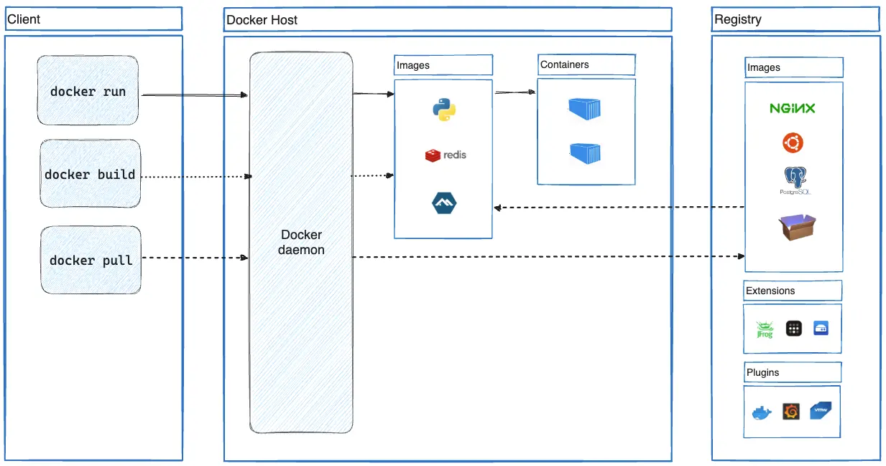

# What is docker ?

Docker lets you **“build once, run anywhere”** by putting applications inside isolated, standardized containers.

Docker is a platform that packages applications and all their dependencies into lightweight, portable containers that run consistently and efficiently on any environment — from a developer’s laptop to production servers in the cloud.

## Architecture
Docker uses a client-server architecture. The Docker client talks to the Docker daemon, which does the heavy lifting of building, running, and distributing your Docker containers. The Docker client and daemon can run on the same system, or you can connect a Docker client to a remote Docker daemon. 

- **Client** — The Docker CLI (docker command) you use to send commands like docker build, docker run, or docker push

- **Docker Host** — The machine (physical server, VM, or cloud instance) that runs the Docker daemon (dockerd), which actually creates, runs and manages containers

- **Registry** — A remote storage service (like Docker Hub, GitHub Container Registry, AWS ECR, …) where Docker images are stored, shared and pulled from

---

## Docker Image and Container

- **Docker Image**

A Docker image is a lightweight, immutable, read-only template that bundles an application with its code, dependencies, libraries, runtime, and configuration.
It serves as a portable blueprint that can be shared, versioned, and used to create multiple containers.

- **Docker Container**

A container is a runnable instance of a Docker image, providing an isolated execution environment with its own filesystem, processes, and network.
It adds a thin writable layer on top of the image, allowing the application to run consistently across different systems.

---

**Next: [How docker works?](./howdockerworks.md)**

---