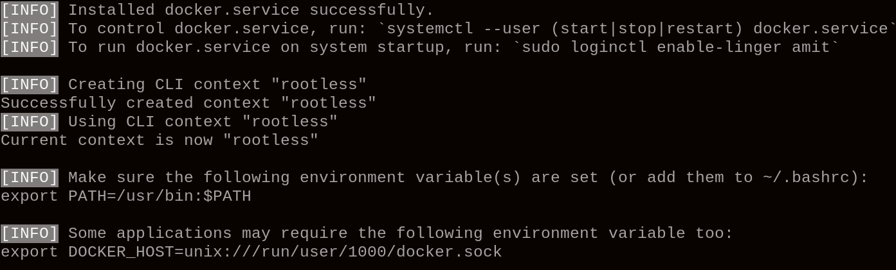
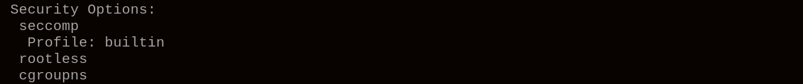
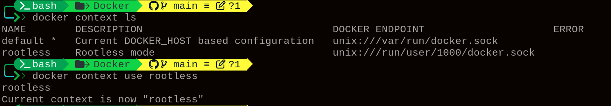

#  Rootless Docker

**Rootless docker** means running Docker daemon and containers as a normal user, not as root user. That means: 
- No root privileges on host
- No root-owned daemon
- Everyting runs inside user space

### Setup Rotless Docker

1. Stop docker service and socket
```bash
sudo systemctl stop docker.service
sudo systemctl stop docker.socket # active socket may auto-start docker again
```

2. Disable docker service and socket
```bash
sudo systemctl disable docker.service
sudo systemctl disable docker.socket
```

3. Install rotless docker
```bash
dockerd-rotless-setuptool.sh install
```


4. Managing rootless service
```bash
# start | stop | status | enable | disable | restart
systemctl --user start docker.service

# Keep the rootless Docker daemon runnign even when the user is not logged in
sudo loginctl enable-linger <user>
```

5. Verify rootless docker
```bash
docker info 
```


6. Remove rootless docker
```bash
# sotp and disable
systemctl --user stop docker
systemctl --user disable docker

# disable linger
sudo lofinctl disable-linger <user>

# additionally remove configurations, images 
sudo rm -rf ~/.docker ~/.local/share/docker ~/.local/lib/docker ~/.config/docker

# run rootfull docker
sudo systemctl start docker
sudo systemctl enable docker 
docker info
```

7. Setup both rootless and rootfull docker
```bash
# start and enable docker
sudo systemctl start docker
sudo systemctl enable docker

# install rootless docker
dockerd-rootless-setuptool.sh install --force

# start rootless docker for user
systemctl --user start docker.service

# enable-linger
sudo loginctl enable-linger $USER

# list docker context
docker context ls

# use docker context
docker context use <context>
```


###  Strengths

1. **Host Safety:** Container root cannot affect host root.
2. **No Root Daemon:** Docker runs entirely as normal user.
3. **Secure by Default:** Works with namespaces, seccomp, and cgroups.
4. **Multi-user Isolation:** Each user can run separate daemons safely.
5. **Privilege Protection:** Container root ≠ host root, limiting attack impact.

---

###  Drawbacks & Solutions

1. **Cannot bind ports <1024:** Map higher host ports (e.g., 8080:80) or use a reverse proxy.
2. **No privileged containers:** Refactor containers to avoid privileged operations or use rootful Docker when necessary.
3. **Slower networking:** Accept user-space networking or use rootful Docker for high-performance network apps.
4. **Limited cgroup enforcement:** Upgrade kernel or manage limits with systemd slices.
5. **Doesn’t auto-start on logout:** Enable linger with `sudo loginctl enable-linger <user>` so rootless Docker runs in background.

---


## Real-wold Use Cases

### 1️ **CI/CD Pipelines (GitHub Actions, GitLab Runners)**
* Rootless containers let you **run builds and tests safely** without giving root access to the host.
* Even if a build script is malicious, it cannot harm the server.

---

### 2️ **Developer Sandboxes**

* Developers can spin up containers **without sudo**, avoiding conflicts with host apps.
* Perfect for testing apps or experimenting with images safely on shared machines.

---

### 3️ **Multi-user Shared Servers**

* On servers with many users, each user can run their **own Docker daemon** without interfering with others.
* No user can compromise host root or other users’ containers.

---

### 4️ **Educational & Lab Environments**

* Teaching Linux, Docker, or DevOps in schools/universities.
* Students can run root-level commands inside container safely without risking the lab host system.

---

### 5️ **Self-hosted Applications in Non-root Environments**

* Home servers, VPS, or cloud instances where you **cannot run root Docker**.
* Example: hosting **personal web apps, databases, or dev environments** entirely under user privileges.

---


