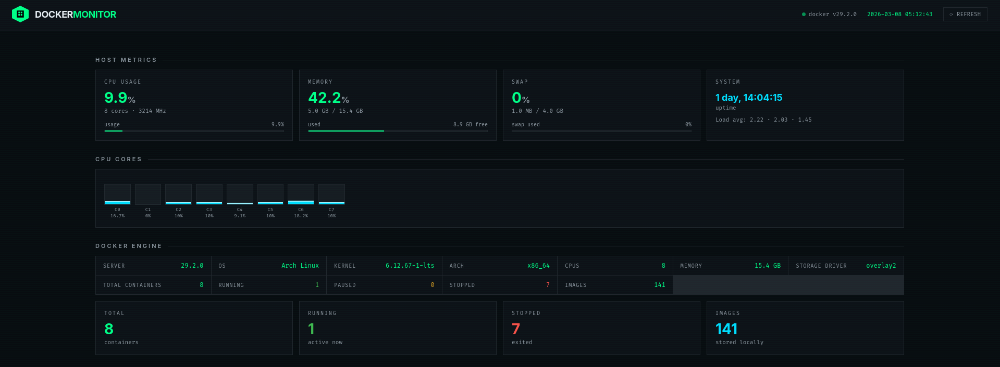

# Docker Host Monitoring

This hands-on exercise uses a Python application that monitors the Docker host. We will write a Dockerfile, build a Docker image, create a docker-compose file, and run the application inside a container. Additionally, we will log in to a registry, tag the image, and push the image to the registry.

---

## Preview



---

## Prerequisites

- 1. Download application code
```bash
monitoring_app.archive.gz
```

- 2. Create Directory Structure

```bash
mkdir monitoring
cd monitoring
```

- 3. Extract the application code

```bash
tar -xvf monitoring_app.archive.gz
```


- 2. Directory Structure

```bash
monitoring/
├── docker-compose.yaml
├── Dockerfile
├── requirements.txt
└── src
    ├── main.py
    ├── static
    │   └── style.css
    └── templates
        └── dashboard.html
```

---


## 1. Write Docker File

```bash
FROM python:3.12-slim

WORKDIR /app

COPY requirements.txt .
RUN pip install --no-cache-dir -r requirements.txt

COPY ./src .
 
EXPOSE 8000

CMD ["uvicorn", "main:app", "--host", "0.0.0.0", "--port", "8000"]
```

---

## 2. Build Docker Image

```bash
docker build -t <image_name:tag> .
```

---

## 3. Write Docker Compose File

```bash
services:
  docker-monitor:
    image: <image:tag>
    ports:
      - "8000:8000"
    volumes:
      # Mount Docker socket so the app can talk to Docker daemon
      - /var/run/docker.sock:/var/run/docker.sock:ro
    restart: unless-stopped
    environment:
      - PYTHONUNBUFFERED=1
```

---

## 4. Run Container

```bash
docker compose up -d
```

---

## 5. Remove Container

```bash
docker compose down 
```

---

## 6. Login To Registry (Dockerhub)

```bash
docker login
```

---

## 7. Tag Image

```bash
docker -t <image:tag> <username>/<repo>:tag
```

---

## 8. Push Image

```bash
docker push <username>/<repo>:tag
```

---